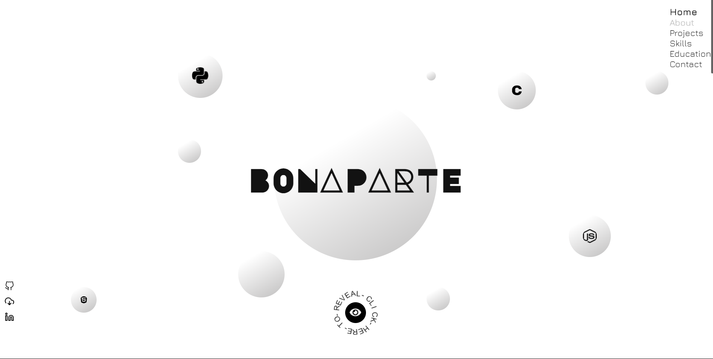
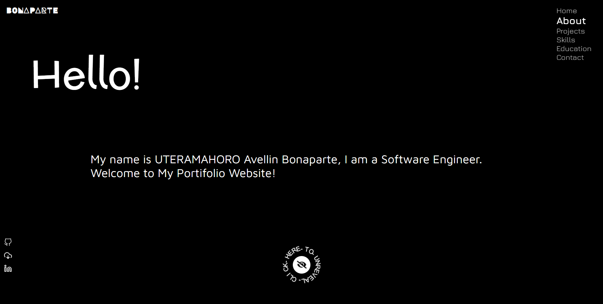
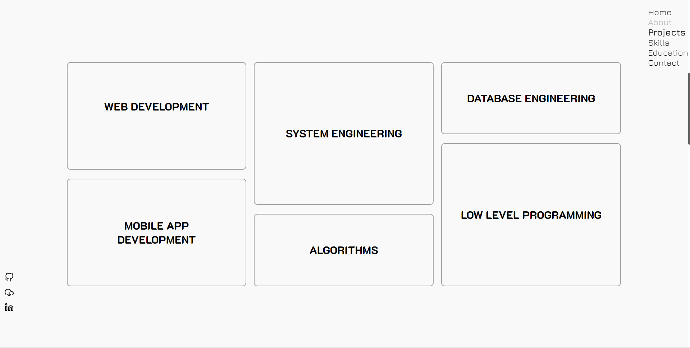
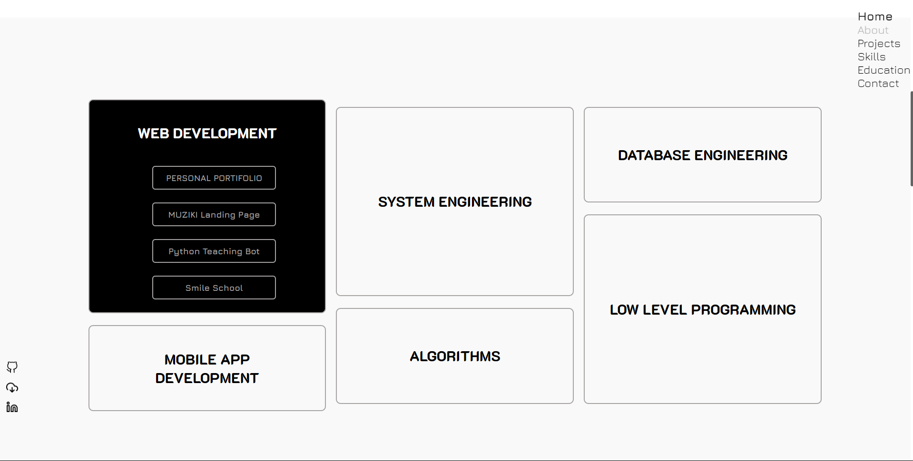
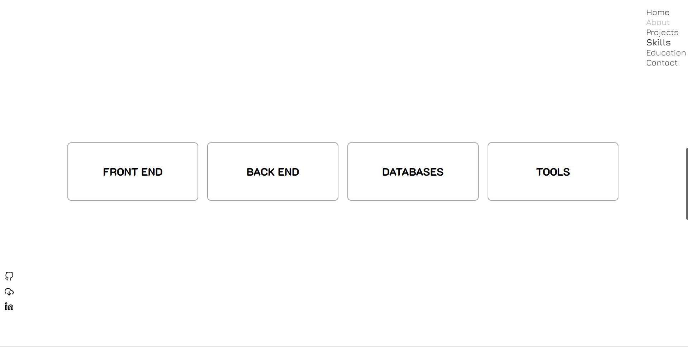
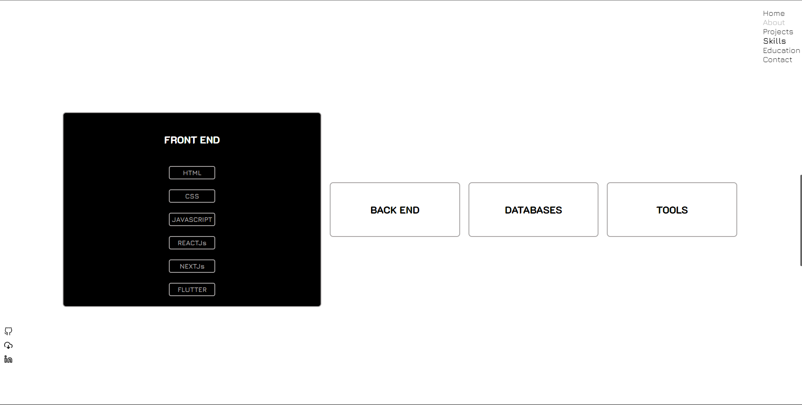
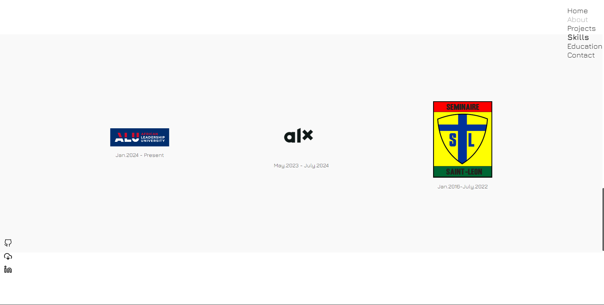
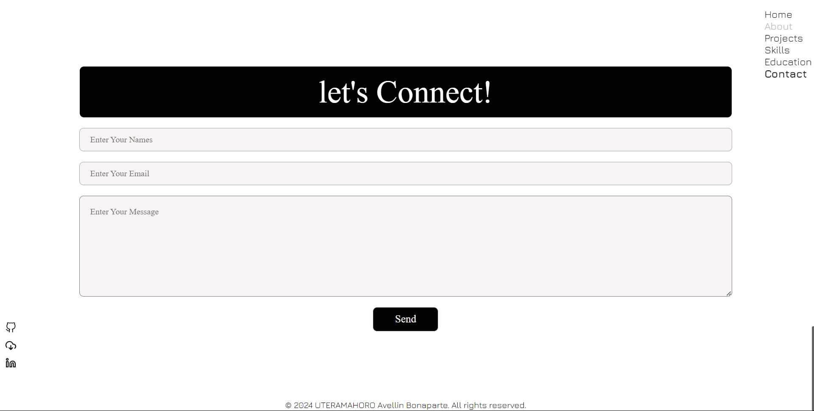

# Bonaparte Portfolio

Welcome to the portfolio website of UTERAMAHORO Avellin Bonaparte. This project showcases various aspects of my work, skills, and education.

## Table of Contents

- [Welcome Page](#welcome-page)
- [About Page](#about-page)
- [Projects Page](#projects-page)
- [Skills Page](#skills-page)
- [Education Page](#education-page)
- [Contact Page](#contact-page)
- Setup
- License

## Welcome Page

The welcome page introduces the website with a navigation menu and a main section featuring a welcome message and various logos.

## About Page

The about page provides a brief introduction about myself, UTERAMAHORO Avellin Bonaparte, and my background as a Software Engineer.

## Projects Page

The projects page lists various projects I have worked on, categorized into web development, mobile app development, system engineering, algorithms, and database engineering.

### Web Development
- [Personal Portfolio](https://6714a8062c60369a325b6591--velvety-empanada-ef4014.netlify.app/)
- [MUZIKI Landing Page](https://lively-entremet-79f585.netlify.app/)
- [Python Teaching Bot](https://py-teaching-bot.vercel.app/)
- [Smile School](https://bonaparte003.github.io/alu-web-development/)

### Mobile App Development
- [MUZIKI Mobile App](https://github.com/Avellin003/Muziki)

### System Engineering
- [ALX System Engineering](https://github.com/Avellin003/alx-system_engineering-devops)
- [Registration System](https://github.com/Bonaparte003/GSCS-Registration_System)

### Algorithms
- [Sorting Algorithms](https://github.com/Avellin003/sorting_algorithms)

### Database Engineering
- [ALX Database Engineering](https://github.com/Avellin003/alx-backend-storagel)
- [E-MITI Management System](https://github.com/Bonaparte003/e-Miti_Inventory_Management_System_Negpod-12)

### Low Level Programming
- [Monty Interpreter](https://github.com/Avellin003/monty)
- [Simple Shell Project](https://github.com/Avellin003/simple_shell)
- [Printf Project](https://github.com/Avellin003/Printf)
- [Low Level Programming](https://github.com/Avellin003/alx-low_level_programming)
- [Binary Trees](https://github.com/Avellin003/binary_trees)

## Skills Page

The skills page lists my expertise in various domains:

### Front End
- HTML
- CSS
- JavaScript
- ReactJs
- NextJs
- Flutter

### Back End
- Python
- C
- NodeJs
- Dart
- Django
- Flask
- Ruby

### Databases
- MySQL
- PostgreSQL
- MongoDB
- Redis

### Tools
- Linux
- Git
- Docker
- Figma
- Puppet

## Education Page

The education page highlights my academic background:

- **African Leadership University (ALU)**: Jan. 2024 - Present
- **ALX**: May 2023 - July 2024
- **Petit Seminaire Saint Leon**: Jan. 2016 - July 2022

## Contact Page

The contact page allows visitors to connect with me by filling out a form with their name, email, and message.

## DEMO









## Setup

To set up the project locally, follow these steps:

1. Clone the repository:
    ```sh
    git clone https://github.com/Bonaparte003/portfolio.git
    ```
2. Navigate to the project directory:
    ```sh
    cd portfolio
    ```
3. Open 

index.html

 in your browser to view the website.

## License

&copy; 2024 UTERAMAHORO Avellin Bonaparte. All rights reserved.